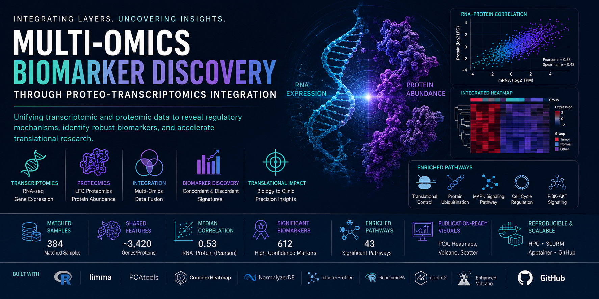

<p align="center">
  
</p>

# Multi-Omics Biomarker Discovery through Proteo-Transcriptomics Integration

> Integrated transcriptomics and proteomics pipeline for biomarker discovery, systems biology, and translational multi-omics analysis.

<p align="center">


</p>

---

# Overview

This project presents a scalable and reproducible multi-omics integration framework designed to combine transcriptomic and proteomic data for biomarker discovery and systems-level biological interpretation.

By integrating RNA sequencing (RNA-seq) and quantitative proteomics data, the workflow identifies:

- Concordant RNA–protein signatures
- Post-transcriptional regulatory divergence
- Disease-associated biomarkers
- Therapeutic target candidates
- Dysregulated signaling pathways

The project emphasizes:

- Translational bioinformatics
- Reproducible computational biology
- Multi-omics systems biology
- Biomarker prioritization
- High-performance computing workflows

---

# Key Features

- End-to-end proteo-transcriptomics integration workflow
- RNA–protein correlation analysis
- Multi-omics dimensionality reduction and clustering
- Batch correction across omics platforms
- Identification of concordant and discordant biomarkers
- Functional enrichment using GO and Reactome
- Publication-quality visualization pipeline
- HPC-ready modular workflow architecture
- Educational framework for systems biology training

---

# Research Applications

This framework supports:

- Cancer biomarker discovery
- Precision medicine research
- Systems biology analysis
- Multi-omics integration
- Translational oncology
- Therapeutic target prioritization
- Post-transcriptional regulation studies

---

# Dataset Summary

| Attribute | Details |
|---|---|
| Transcriptomics | RNA-seq TPM/FPKM matrices |
| Proteomics | LFQ protein abundance matrices |
| Samples | 384 matched biological samples |
| Shared Features | ~3,420 gene/protein identifiers |
| Disease Context | Public cancer and cell-line datasets |
| Data Sources | GEO, CPTAC, PRIDE |

---

# Pipeline Architecture

## Workflow Overview

```text
RNA-seq Data + Proteomics Data
               ↓
Data Harmonization
               ↓
Normalization & Batch Correction
               ↓
Dimensionality Reduction
               ↓
RNA–Protein Correlation Analysis
               ↓
Feature Selection
               ↓
Pathway Enrichment
               ↓
Integrated Visualization
               ↓
Biological Interpretation
```

---

# Methodology

## 1. Data Ingestion

Loaded transcriptomic and proteomic expression matrices and ensured sample concordance across omics layers.

### Tools
- `readr`
- `data.table`

---

## 2. Normalization & Batch Correction

Applied platform-specific normalization and corrected batch effects across datasets.

### Methods
- Quantile normalization
- Batch effect correction
- Scaling and variance stabilization

### Tools
- `NormalyzerDE`
- `limma`

---

## 3. Dimensionality Reduction

Performed unsupervised exploratory analysis using:

- Principal Component Analysis (PCA)
- Hierarchical clustering
- Multi-omics heatmaps

### Tools
- `PCAtools`
- `ComplexHeatmap`

---

## 4. RNA–Protein Correlation Analysis

Calculated transcript–protein concordance using:

- Pearson correlation
- Spearman correlation

to identify:

- Consistently regulated biomarkers
- Post-transcriptionally regulated genes
- Divergent signaling mechanisms

---

## 5. Feature Selection

Identified:

- High-confidence concordant biomarkers
- High-divergence regulatory outliers
- Candidate therapeutic targets

### Examples
- Concordant: `GAPDH`, `ACTB`, `EGFR`
- Discordant: `TP53`, `MYC`, `CCND1`

---

## 6. Pathway Enrichment Analysis

Performed functional enrichment analysis on significant genes and proteins.

### Tools
- `clusterProfiler`
- `ReactomePA`
- `biomaRt`

### Pathway Sources
- Gene Ontology (GO)
- Reactome
- KEGG

---

## 7. Visualization

Generated publication-quality visualizations including:

- PCA plots
- Correlation heatmaps
- RNA–protein scatter plots
- Integrated volcano plots
- Cluster heatmaps

### Tools
- `ggplot2`
- `EnhancedVolcano`
- `ggcorrplot`
- `pheatmap`

---

## 8. Reporting & Reproducibility

Structured outputs into a reproducible RMarkdown-based workflow with:

- Automated logging
- High-resolution exports
- Config-driven execution

---

# Results

## Multi-Omics Integration Summary

| Metric | Result |
|---|---|
| Matched Samples | 384 |
| Shared Gene/Protein IDs | 3,420 |
| Median RNA–Protein Correlation | 0.53 |
| Significant Biomarkers | 612 |
| Discordant Regulatory Features | 187 |
| Enriched Pathways | 43 significant pathways |

---

# Correlation Analysis

## RNA–Protein Concordance

| Correlation Category | Observation |
|---|---|
| High Concordance | Structural and metabolic genes |
| Moderate Concordance | Housekeeping and signaling genes |
| High Divergence | Cell-cycle and oncogenic regulators |

### Top Concordant Biomarkers

| Gene | Functional Role |
|---|---|
| GAPDH | Glycolysis |
| ACTB | Cytoskeletal regulation |
| EGFR | Growth signaling |
| VIM | EMT marker |

---

## Top Discordant Features

| Gene | Biological Interpretation |
|---|---|
| TP53 | Post-transcriptional regulation |
| MYC | Translational control |
| CCND1 | Protein stability modulation |
| MDM2 | Ubiquitin-mediated regulation |

---

# Pathway Enrichment Findings

## Significantly Enriched Pathways

| Pathway | Adjusted p-value |
|---|---|
| MAPK Signaling | 1.7e-06 |
| Protein Ubiquitination | 4.2e-05 |
| Translational Control | 7.1e-05 |
| Cell Cycle Regulation | 1.5e-04 |
| PI3K-AKT Signaling | 2.3e-04 |

---

# Biological Insights

- Signal transduction proteins demonstrated the highest RNA–protein divergence
- Multiple concordant biomarkers were associated with cancer progression and therapy resistance
- Discordant signatures highlighted post-transcriptional and translational regulation mechanisms
- Multi-omics integration improved biological interpretability compared to single-omics analysis

---

# Tech Stack

## Programming Languages

- R
- Bash

---

## Bioinformatics & Data Science Libraries

- limma
- PCAtools
- ComplexHeatmap
- NormalyzerDE
- clusterProfiler
- ReactomePA
- biomaRt
- ggplot2
- EnhancedVolcano
- ggcorrplot
- pheatmap

---

## Infrastructure

- RStudio
- SLURM clusters
- HPC environments
- Apptainer containers
- Cloud-compatible execution

---

# Repository Structure

```text
├── data/
├── metadata/
├── notebooks/
├── scripts/
├── results/
├── figures/
├── reports/
├── logs/
├── containers/
├── configs/
├── README.md
└── environment.yml
```

---

# Reproducibility & Engineering Practices

- Modularized R workflows
- Config-driven execution
- Automated logging and checkpointing
- High-resolution figure exports
- HPC-ready pipeline architecture
- Containerized reproducible environments
- GitHub-hosted tutorial workflows

---

# Educational Integration

This project was designed as a practical teaching framework for students in:

- Systems biology
- Multi-omics integration
- Biomarker discovery
- Computational biology
- Translational bioinformatics
- Reproducible research practices

Each module includes guided workflows and reproducible analysis exercises.

---

# Future Directions

| Direction | Research Impact |
|---|---|
| Phospho-Proteomics Integration | Investigate post-translational regulation |
| Time-Series Multi-Omics | Capture dynamic regulatory responses |
| Machine Learning Biomarker Ranking | Improve multi-omics feature prioritization |
| Clinical Metadata Integration | Stratify by disease subtype and treatment response |
| Interactive Dashboards | Enhance reproducibility and exploratory analysis |

---

# Applications

This framework is applicable to:

- Precision oncology
- Biomarker discovery
- Translational medicine
- Systems biology
- Multi-omics analytics
- Drug target prioritization
- Clinical bioinformatics
- AI-assisted biomedical research

---

# Citation

```bibtex
@misc{atallah_multiomics_2026,
  author = {Atallah, Nabil},
  title = {Multi-Omics Biomarker Discovery through Proteo-Transcriptomics Integration},
  year = {2026},
  publisher = {GitHub},
  journal = {GitHub Repository}
}
```

---

# Author

## Nabil Atallah, Ph.D

Computational Biology | Multi-Omics Bioinformatics | AI in Healthcare | Translational Systems Biology

📧 Nabilatallah@hotmail.com

---

# License

This project is licensed under the MIT License.
